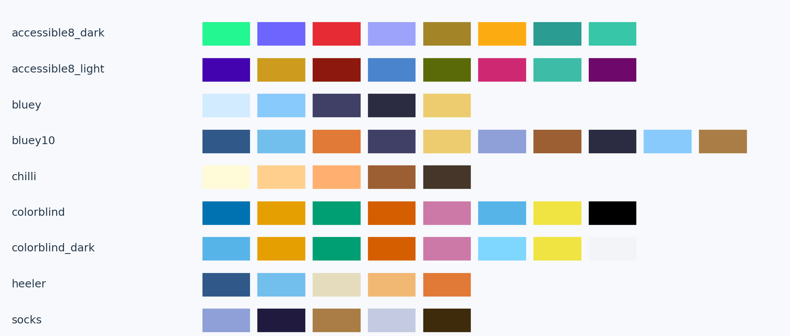
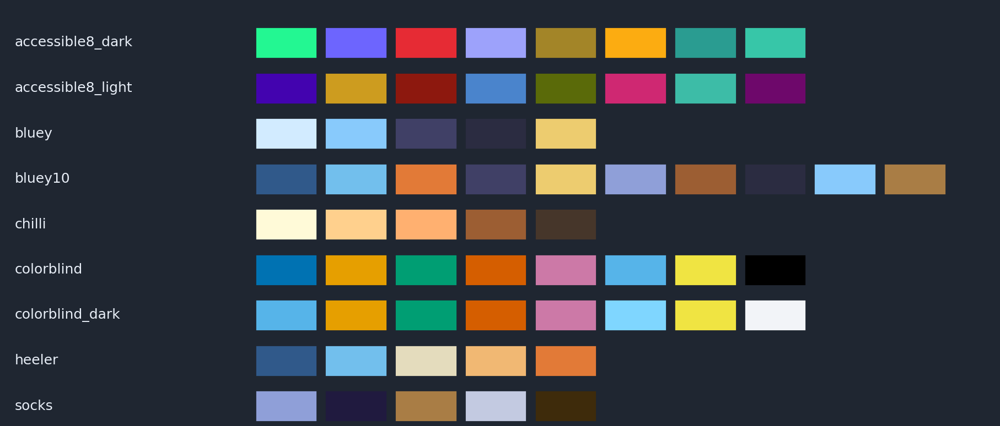
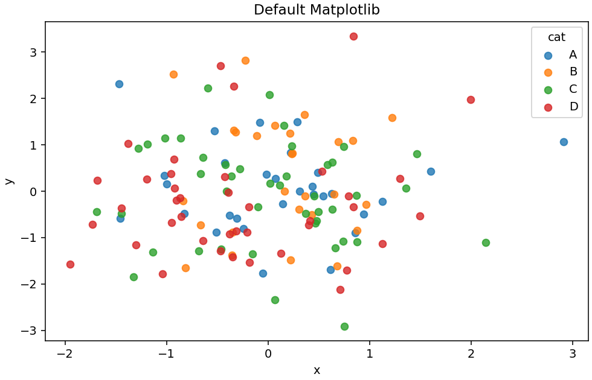
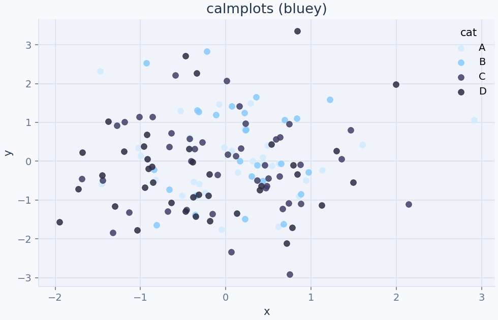
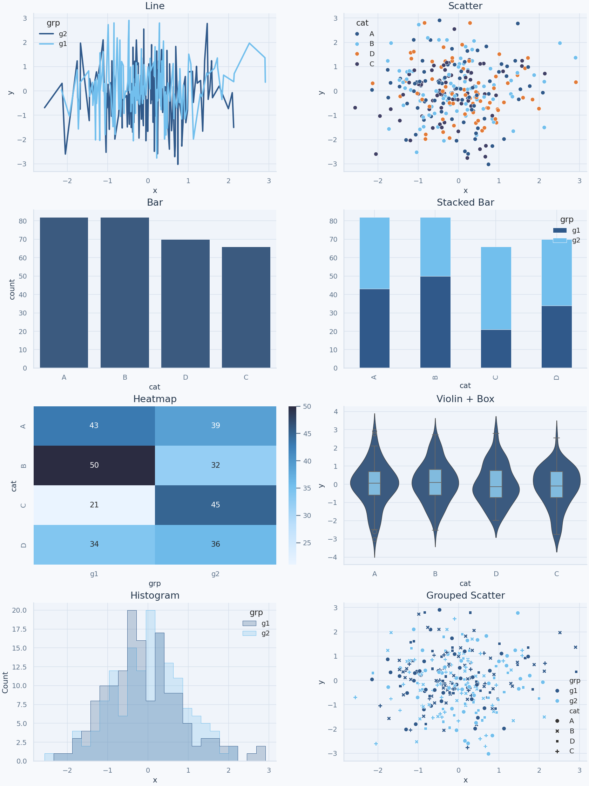
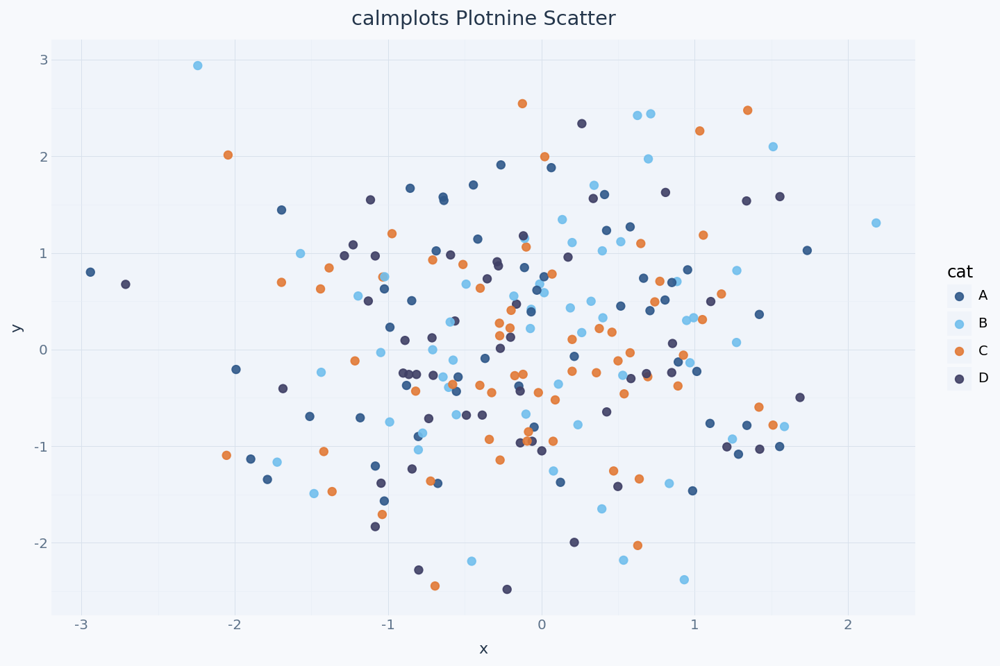
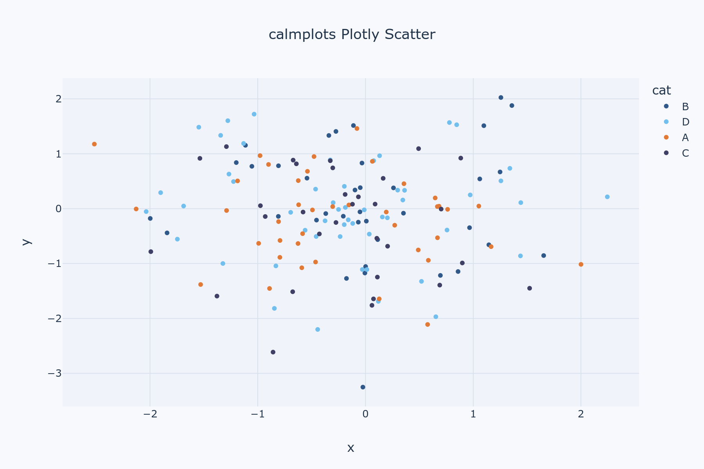
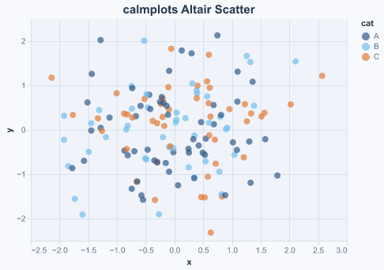

# calmplots

[](https://github.com/techwizrd/calmplots/actions/workflows/ci.yml)
[](https://github.com/techwizrd/calmplots/actions/workflows/docs.yml)
[](https://codecov.io/gh/techwizrd/calmplots)
[](https://www.apache.org/licenses/LICENSE-2.0)
[](https://www.python.org/downloads/)
[](https://pre-commit.com/)

`calmplots` is a cohesive visualization theme package for:

- Matplotlib
- Seaborn
- Plotnine
- Plotly
- Altair

It is inspired by the spirit of the [`blueycolors`](https://github.com/ekholme/blueycolors) palette family and aims to provide attractive, consistent defaults across notebooks, reports, and dashboards.

## Palette compatibility

- Exact `blueycolors` palettes: `bluey`, `chilli`, `heeler`, `socks`
- calmplots extensions: `bluey10`, `colorblind`, and continuous ramps (`bluey_seq`, `sunset_seq`, `bluey_div`)
- In dark themes, `colorblind` is automatically mapped to a dark-safe variant for contrast.
- Public API stability: names exported in `calmplots.__all__` are considered stable

## Palette quick guide

- Use `bluey`, `chilli`, `heeler`, or `socks` when you want strict `blueycolors` compatibility.
- Use `colorblind` when category distinction and accessibility are the top priority.
- Use `accessible_palette(theme="light"|"dark")` for CVD-optimized defaults.
- Use `bluey10` for larger categorical charts (up to 10 categories).
- For very high category counts, group categories and highlight only key series.
- Use continuous ramps (`bluey_seq`, `bluey_div`) for heatmaps and gradients.

Accessibility note:

- `calmplots` uses Color Vision Deficiency (CVD) simulation checks, perceptual distance checks, and contrast checks for accessibility-focused palettes.
- This evidence supports real-world usage. It does not claim universal suitability for all CVD types, severities, or chart designs.

## Attribution

The base palette set is derived from
[`blueycolors`](https://github.com/ekholme/blueycolors) by Eric Ekholm.

## Install with uv

```bash
uv sync --extra all
```

For docs and test tooling only:

```bash
uv sync --extra docs --extra test
```

For full development (all backends + docs + checks):

```bash
uv sync --extra dev
```

## Quickstart

```python
import calmplots

# Matplotlib + Seaborn
calmplots.apply_matplotlib_theme()
calmplots.set_seaborn_theme(context="notebook")

# Plotly
calmplots.register_plotly_template(set_default=True)

# Altair
calmplots.enable_altair_theme()
```

## Core design

- Clarity first: readable labels, lines, and grid hierarchy
- Consistent tokens: one semantic token source reused across backends
- Sensible defaults: subtle grid, softened spines, accessible emphasis
- Accessible by design: includes a colorblind-considerate categorical palette

## Documentation

- Website: [techwizrd.github.io/calmplots](https://techwizrd.github.io/calmplots/)
- Quickstart: [Quickstart](https://techwizrd.github.io/calmplots/quickstart.html)
- Do/Don't guide: [Do/Don't](https://techwizrd.github.io/calmplots/do_dont.html)
- Compatibility notes: [Compatibility](https://techwizrd.github.io/calmplots/compatibility.html)
- Colorblindness approach: [Colorblindness](https://techwizrd.github.io/calmplots/colorblindness.html)
- Gallery page: [Gallery](https://techwizrd.github.io/calmplots/gallery.html)
- Matrix index: [examples/gallery/matrix/README.md](examples/gallery/matrix/README.md)

## Gallery Preview

Palette Gallery (all palettes)

Light background



Dark background



Before vs After (Matplotlib)

| Default Matplotlib | calmplots |
|---|---|
|  |  |

Matplotlib/Seaborn



Plotnine



Plotly



Altair



## Contributing

See `CONTRIBUTING.md` for development setup, checks, and release process.
