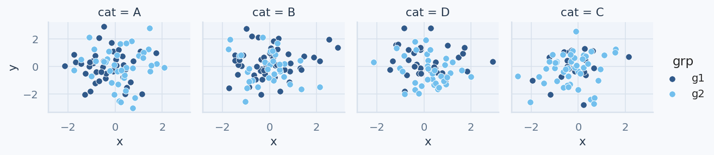

Gallery
=======

This page highlights a curated subset of the generated gallery outputs.
For the full light/dark x palette x backend matrix with direct artifact links,
see `examples/gallery/matrix/README.md <https://github.com/techwizrd/calmplots/blob/main/examples/gallery/matrix/README.md>`_.

Palette gallery (all palettes)
------------------------------

Light background

.. image:: ../../examples/gallery/palettes_light.png
   :alt: calmplots palette gallery on light background
   :width: 900

Dark background

.. image:: ../../examples/gallery/palettes_dark.png
   :alt: calmplots palette gallery on dark background
   :width: 900

Matplotlib + Seaborn
--------------------

.. image:: ../../examples/gallery/gallery_matplotlib.png
   :alt: Matplotlib and seaborn multi-plot gallery
   :width: 700

Plotly
------

.. image:: ../../examples/gallery/plotly_scatter.png
   :alt: Plotly scatter
   :width: 700

Altair
------

.. image:: ../../examples/gallery/altair_scatter.png
   :alt: Altair scatter
   :width: 700

Plotnine
--------

.. image:: ../../examples/gallery/plotnine_scatter.png
   :alt: Plotnine scatter
   :width: 700
